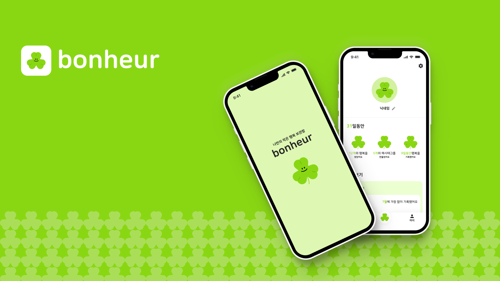
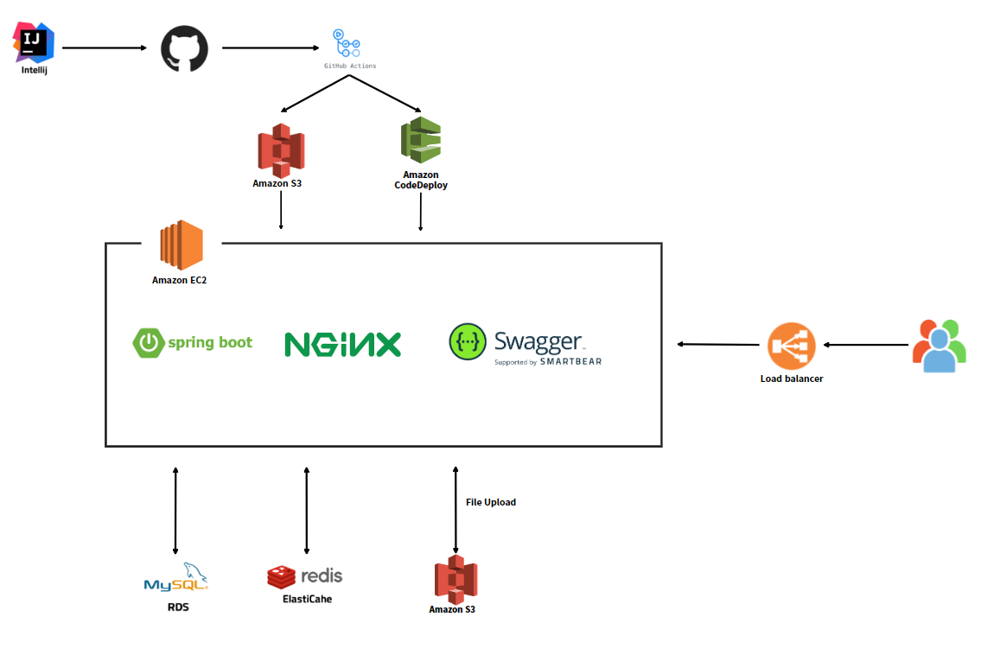

# Bonheur Back-end

### 프로젝트 설명

**보네르**는 하루 속에서 행복했던 일을 찾아 기록하는 것을 통해, 사용자가 더욱 행복한 삶을 보낼 수 있도록 돕는 사용자 기반서비스입니다.

## 기술 스택

### 애플리케이션 (Language & Framework)

- **Language** - Java 11
- **Framework** - Spring Framework (Spring Boot, Spring MVC)
- **Data(RDBMS)** - JPA/Hibernate, MySQL
- **Build Tool** - Gradle
- **Infra** - AWS EC2, AWS RDS, AWS S3
- **DB** - MySQL(RDS), Redis(ElastiCache)
- **CI/CD** - Github Actions
- **API Sheet** - Swagger

### 인프라 아키텍처
